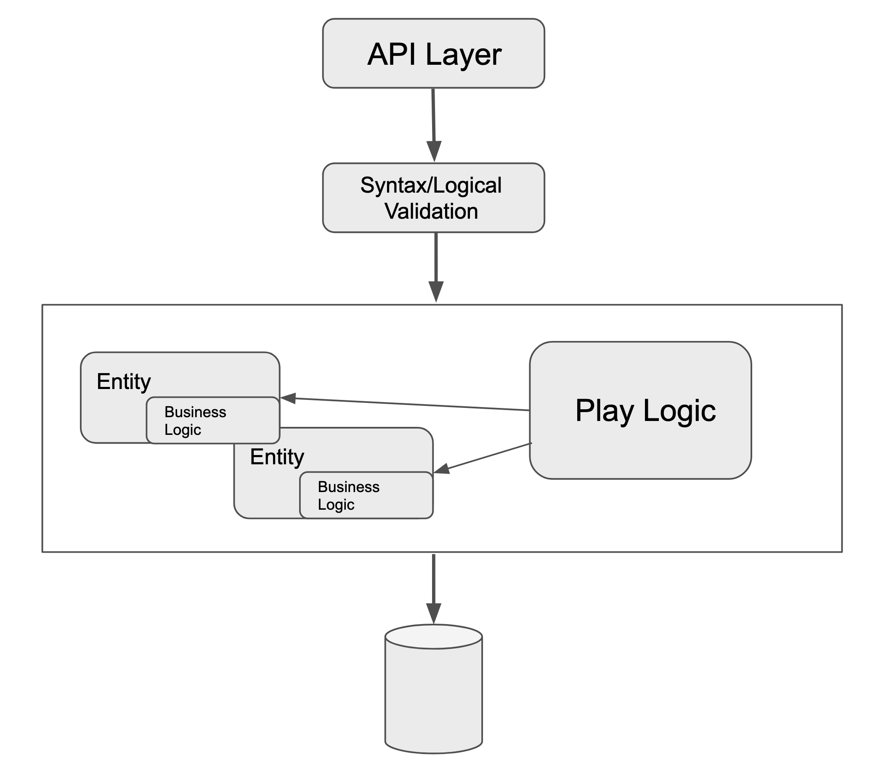
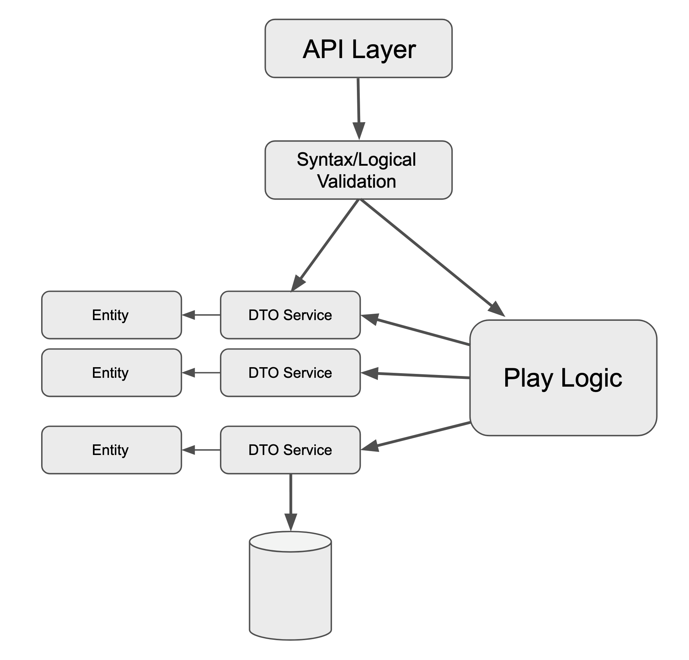

## ProQuiz

ProQuiz is a trivia game, pretty much like _Who wants to be a millionaire_.

### Glimpse of history

I started this project with the idea to create a multistage simple interview quiz. Nothing new on the horizon. Something I would develop in my free time and I wanted to propose to my company. I quickly realized that this idea would not be suitable for the context so I decide to make a U turn and develop something a bit different.

There are plenty of similar solutions out there. Absolutely doesn't want to be something innovative. I just wanted to implement it and learn while doing something funny.

### Technologies

When I started working on the quiz I opted for [Pyramid](https://docs.pylonsproject.org/projects/pyramid/en/latest/) because I wanted to learn this framework. So I completed the v.0.1 using Pyramid (plus many other libraries). Although it is more a Model-View-Template tool, I developed my solution using a standard REST CRUD approach. A set of endpoints mapped to a set of entities (aka `models`) with a simple validation mechanism in between, plus the _play_ logic.

When the development of the first version, driven by tests (TDD), was completed I started pursuing the idea to develop the Frontend too, or at least make it feasible for someone (most likely a friend) to jump in and code.



### FastAPI

Moreover I thought: if I want to grow this project or keep working the way I have in mind, maybe is suitable to switch to a more adopted framework. I decided to port the project to [FastAPI](https://fastapi.tiangolo.com/) as it seemed to fit better for a purely API based Backend.

### Different structure

This project still preserve the monolithic architecture. FastAPI and its intense adoption of the dependency injection pattern forced me to rethink the structure and more specifically where the ORM logic resides.

Driven by the existing test suite I developed the new current version. The test suite required a small initial effort to work, due to the way database session objects are fetched when a request reaches the endpoint. Things started to work quickly after.

In the new structure I emptied the `entities` class of any logic but the simple properties used to return some internal date in a more comfortable mode. Moved the interface to the ORM to a new set of `classes` called `DataTransferObject`(`DTO`).



### Validation

To ease testing also the validation mechanism is structured into two components: `syntax` and `logical`. The former, as the terms indicates, verifies that the incoming data respects the expected data types.

The latter verifies that the objects of the `Entities` involved, actually exists and can be manipulated in the sense that some logical constraints are respected.

The syntax check is purely a type verification. The second one interacts with the database to retrieve the object.

### Play

Probably the most interesting component of the project. The idea is simple:

the user starts a match and plays against the system. At each question the user either answers or skips the challenge. Still the `reaction` is recorded. After the last question of the last `game` the `match` is over and a final score is computed.

A match can be stopped and resumed. Can contain N games each one having M questions.

Currently the interface consists of three methods:

- `start`: start the match
- `next`: move to the next question
- `react`: answer the current question

### Compose

To start the application is enough to
```
docker-compose up -d
```

while to reset the environment (this also deletes the DB)
```
docker-compose rm -fs && docker-compose down -v && docker-compose up -d
```

while to run the tests
```
docker-compose exec backend sh tests-start.sh -vv
```

To start and fill in the database with some data
```
docker-compose exec backend sh prestart.sh
```

To generate one new migration
```
docker-compose exec backend alembic revision --autogenerate -m "give a name to the migration here"
```

To apply one migration
```
docker-compose exec backend alembic upgrade head
```

To revert one migration
```
docker-compose exec backend alembic downgrade -1
```


### PgAdmin

Once the containers are started, you can navigate to the [PgAdmin Panel](http://localhost:5050/browser/) and access with the PGADMIN credentials stored in the `.env` file

Once logged in, these are the steps to follow to access the DB:
- click on `Add New Server`
- give it a name (ex: `LocalDB`)
- within the same popup/modal, move to the `Connection` tab and
    - insert `quizdb` (or the name you assigned to the database service in the docker-compose file)
	- leave the default port
	- username is the `POSTGRES_USER` as specified in the `.env` file
	- password is the `POSTGRES_PASSWORD` as specified in the `.env` file
- click `SAVE`

To browse the DB tables, this would be the path
```
LocalDB ==> app ==> Schemas ==> public ==> tables
```

Google *PgAdmin tutorial* for more info

### Interaction

There is a composed command that mimics the basic interactaction a user might perform using a GUI. This command can be started via
```
docker-compose exec backend sh gui.sh
```
